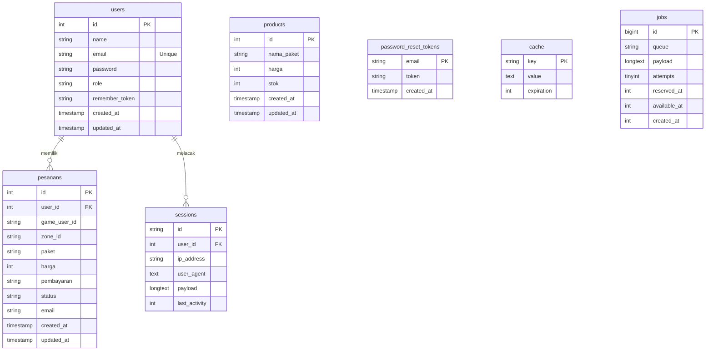

# 💎 DiamondStore - Web-Based Mobile Legends Top-Up Portal

A premium, automated web application built using **Laravel 11**, **Tailwind CSS**, **MySQL**, and **APIGames API** integration. This portal allows players to purchase Mobile Legends: Bang Bang (MLBB) diamonds with instant account verification, and provides administrators with a sleak dashboard for product stock control and transaction log monitoring.

---

## 🚀 Fitur Utama (Core Features)

### 👤 Portal Pelanggan (Customer Features)
- **🔍 Cek Akun Mobile Legends (Fetch API)**: Verifikasi asinkronus untuk mendeteksi *nickname* game berdasarkan User ID & Zone ID sebelum checkout untuk menghindari salah kirim.
- **💎 Formulir Top-Up Dinamis**: Pilihan paket diamond dibaca secara *real-time* dari database dengan validasi stok otomatis (pembelian diblokir jika stok habis).
- **💳 Beragam Metode Pembayaran**: Mendukung simulasi pembayaran populer seperti DANA, GoPay, OVO, Transfer BCA/BRI, dan ritel (Indomaret/Alfamart).
- **📋 Riwayat Pesanan**: Tabel riwayat transaksi lengkap dengan detail status, tanggal, metode bayar, dan total harga.
- **🧾 Struk Digital (Invoice Detail)**: Struk belanja berdesain premium dengan kode pesanan terstruktur (**`#PS-0000xx`**).
- **🌓 Mode Gelap/Terang (Dark/Light Mode)**: Peralihan tema menggunakan cookies (`color-theme`) tanpa kedipan layar (*flicker*) saat halaman dimuat ulang.

### 📊 Dashboard Admin (Admin Features)
- **📈 Statistik Ringkasan Harian**: Kartu grafik yang menghitung Pesanan Hari Ini, Pendapatan Hari Ini (Rp), dan Total Diamond Terjual Hari Ini.
- **📦 Kelola Stok Produk (CRUD)**: Menambah, mengubah detail, dan menghapus paket produk diamond lewat popup modal interaktif.
- **⚡ Live Search Stok**: Pencarian instan produk berdasarkan nama paket atau ID produk di sisi frontend.
- **📜 Log Pesanan Pelanggan**: Tabel komprehensif seluruh transaksi pelanggan dengan sistem paginasi (*pagination*) dan akses cepat ke detail invoice masing-masing.
- **🔒 Proteksi Keamanan**: Pembatasan akses ke menu `/admin/*` menggunakan Middleware khusus role `admin`.

---

## 🛠️ Teknologi yang Digunakan (Tech Stack)

- **Backend**: PHP 8.2+, Laravel 13.
- **Frontend**: Tailwind CSS, Alpine.js, Vanilla JS.
- **Database**: MySQL.
- **Asset Bundler**: Vite.
- **Penyedia API**: APIGames REST API
- **Hosting / Deploy**: Railway.

---

## 📊 Entity Relationship Diagram (ERD)

Berikut adalah struktur hubungan antar tabel database di proyek ini:



---

## 💻 Cara Instalasi & Menjalankan Proyek (Setup Guide)

### 1. Prasyarat (Prerequisites)
Pastikan komputer Anda sudah terpasang:
- PHP >= 8.2
- Composer
- Node.js & NPM
- MySQL Database

### 2. Kloning Repositori
```bash
git clone https://github.com/username/repository-name.git
cd repository-name/LARAVEL
```

### 3. Instal Dependensi
```bash
composer install
npm install
```

### 4. Konfigurasi Environment File
Salin file `.env.example` menjadi `.env`:
```bash
cp .env.example .env
```
Buka file `.env` dan konfigurasikan koneksi database MySQL Anda:
```env
DB_CONNECTION=mysql
DB_HOST=127.0.0.1
DB_PORT=3306
DB_DATABASE=nama_database_anda
DB_USERNAME=username_database_anda
DB_PASSWORD=password_database_anda
```

### 5. Generate Application Key
```bash
php artisan key:generate
```

### 6. Jalankan Migrasi & Seeder Database
Buat semua tabel database dan isi data produk bawaan dengan perintah:
```bash
php artisan migrate:fresh --seed
```

### 7. Jalankan Server Pengembangan
Buka dua terminal terpisah dan jalankan perintah ini:
* **Terminal 1 (Backend)**:
  ```bash
  php artisan serve
  ```
* **Terminal 2 (Frontend)**:
  ```bash
  npm run dev
  ```

Akses aplikasi web di browser Anda pada alamat: **[http://localhost:8000](http://localhost:8000)**.

---

## 🔑 Kredensial Login Bawaan (Default Credentials)

Setelah menjalankan database seeder, Anda dapat login menggunakan akun admin berikut untuk mengakses Dashboard Admin:
- **Email**: `admin@gmail.com`
- **Password**: `admin123`
