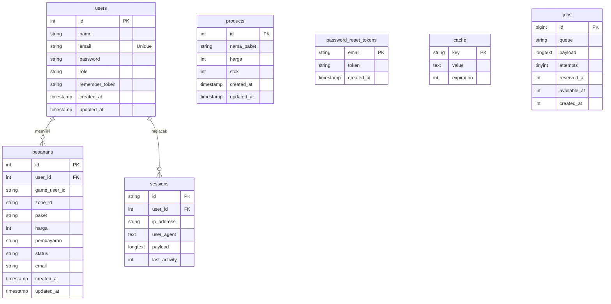

# 💎 DiamondStore
---

## Fitur Utama

### Portal Pelanggan
- **Cek Akun Mobile Legends (Fetch API)**: Verifikasi asinkronus untuk mendeteksi *nickname* game berdasarkan User ID & Zone ID sebelum checkout untuk menghindari salah kirim.
- **Formulir Top-Up Dinamis**: Pilihan paket diamond dibaca secara *real-time* dari database dengan validasi stok otomatis (pembelian diblokir jika stok habis).
- **Riwayat Pesanan**: Tabel riwayat transaksi lengkap dengan detail status, tanggal, metode bayar, dan total harga.
- **Mode Gelap/Terang (Dark/Light Mode)**: Peralihan tema menggunakan cookies (`color-theme`) tanpa kedipan layar (*flicker*) saat halaman dimuat ulang.

### Dashboard Admin
- **Statistik Ringkasan Harian**: Kartu grafik yang menghitung Pesanan Hari Ini, Pendapatan Hari Ini (Rp), dan Total Diamond Terjual Hari Ini.
- **Kelola Stok Produk (CRUD)**: Menambah, mengubah detail, dan menghapus paket produk diamond lewat popup modal interaktif.
- **Live Search Stok**: Pencarian instan produk berdasarkan nama paket atau ID produk di sisi frontend.
- **Log Pesanan Pelanggan**: Tabel komprehensif seluruh transaksi pelanggan dengan sistem paginasi (*pagination*) dan akses cepat ke detail invoice masing-masing.
- **Proteksi Keamanan**: Pembatasan akses ke menu `/admin/*` menggunakan Middleware khusus role `admin`.

---

## Teknologi yang Digunakan

- **Backend**: PHP 8.2+, Laravel 13.
- **Frontend**: Tailwind CSS, Alpine.js, Vanilla JS.
- **Database**: MySQL.
- **Asset Bundler**: Vite.
- **Penyedia API**: APIGames REST API
- **Hosting / Deploy**: Railway.

---

## 📊 Entity Relationship Diagram (ERD)

Berikut adalah struktur hubungan antar tabel database di proyek ini:

---
